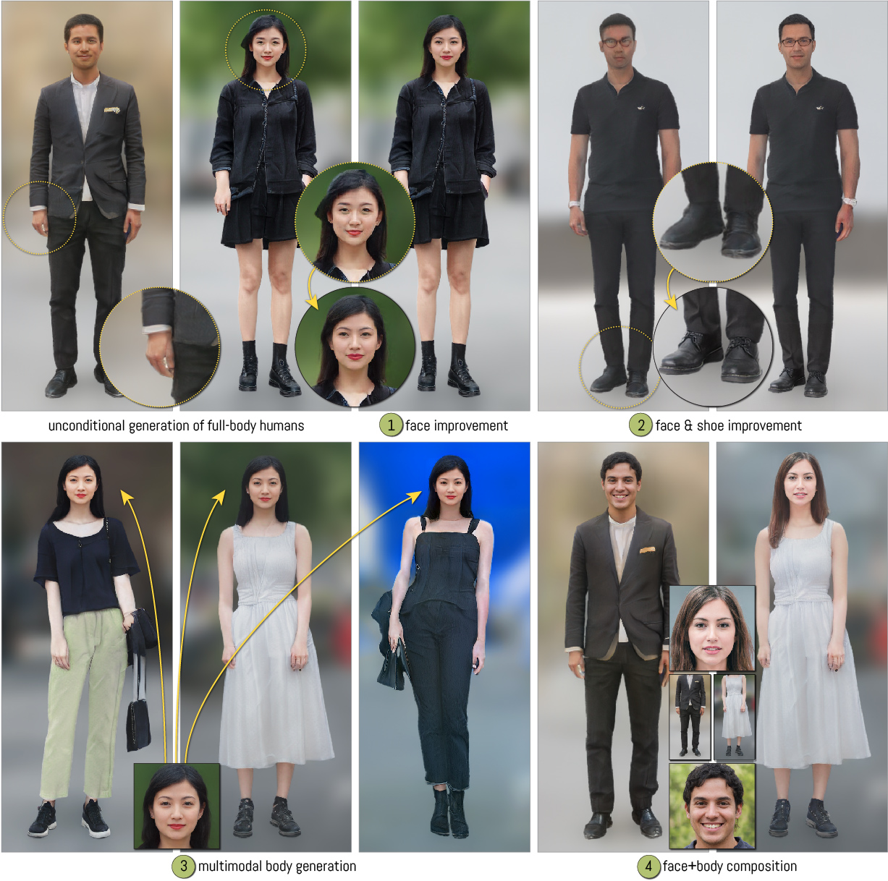
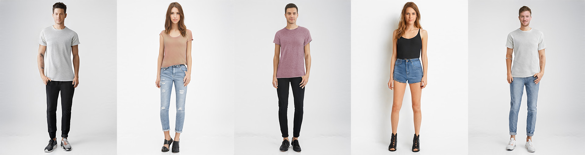

# InsetGAN &mdash; Official PyTorch implementation




<a href='https://arxiv.org/abs/2203.07293'>**InsetGAN for Full-Body Image Generation**</a><br>
****Anna Frühstück, Krishna Kumar Singh, Eli Shechtman, Niloy Mitra, Peter Wonka, Jingwan Lu****<br>
***published at CVPR 2022***<br>
[Project Webpage](http://afruehstueck.github.io/insetgan)

**Abstract**
While GANs can produce photo-realistic images in ideal conditions for certain domains, the generation of full-body human images remains difficult due to the diversity of identities, hairstyles, clothing, and the variance in pose. Instead of modeling this complex domain with a single GAN, we propose a novel method to combine multiple pretrained GANs, where one GAN generates a global canvas (e.g., human body) and a set of specialized GANs, or insets, focus on different parts (e.g., faces, shoes) that can be seamlessly inserted onto the global canvas. We model the problem as jointly exploring the respective latent spaces such that the generated images can be combined, by inserting the parts from the specialized generators onto the global canvas, without introducing seams. We demonstrate the setup by combining a full body GAN with a dedicated high-quality face GAN to produce plausible-looking humans. We evaluate our results with quantitative metrics and user studies.

## Prerequisites
This code has been tested with `pytorch 1.10` and uses `facenet-pytorch`. 
You can install all requirements from `insetgan-env.yml` using `conda env create -f insetgan-env.yml`

In order to load models trained using `stylegan2-ada-pytorch`, you also need to copy two directories from NVIDIA's code repository to the insetGAN directory:
<a href='https://github.com/NVlabs/stylegan2-ada-pytorch/tree/main/torch_utils'>torch_utils</a> and
<a href='https://github.com/NVlabs/stylegan2-ada-pytorch/tree/main/dnnlib'>dnnlib</a>.
## Code
We share our InsetGAN optimization code in `run_insetgan.py`. 

We provide different configurations depending on the target goal of the optimization algorithm. The target configuration can be set using `import config_x as config` in `run_insetgan.py`.

You can edit the loss weights and optimization parameters in `config_1.py` and `config_2.py`.

## Pre-trained Models
Our code is using models trained using the <a href='https://github.com/NVlabs/stylegan2-ada-pytorch'>`stylegan2-ada-pytorch` implementation by Nvidia</a>.

**Full-body humans**
We provide a pretrained model for generating full-body humans at 1024×768px resolution trained on a subset of images from the <a href='http://mmlab.ie.cuhk.edu.hk/projects/DeepFashion/FashionSynthesis.html'>DeepFashion dataset</a>.

[» Download link «](https://www.dropbox.com/s/e9wf6e8mle4ifzf/DeepFashion_1024x768.pkl)


**Insets**
You can use the pretrained FFHQ face generator as an inset for the face region.

[» Download link «](https://nvlabs-fi-cdn.nvidia.com/stylegan2-ada-pytorch/pretrained/ffhq.pkl)



## Generate your own Human Dataset
Given a database of human images, you can estimate the position of the human body within their image. Provided a segmentation mask or segmentation estimation, you can optionally blur the background.

`[ Code for dataset generation will be shared soon. ]`

## Train your own Models

In order to train your own models for canvas and/or insets, use the code provided by Nvidia in their `stylegan2-ada-pytorch` repository.  
Essentially, you provide your training data in a `.zip` file and train your network using
```
python train.py --outdir=~/training-runs --data=~/mydataset.zip --gpus=1
```
**Training Configuration**
Our models were trained with ADA augmentation, x-flips, and an empirically chosen R1-gamma value (R1=13.1 for our own 1024×1024px human generator, R1=0.2 for our 256×256px face generator).

## Citation
If you use this code for your research, please cite our paper.
```
@inproceedings{Fruehstueck2022InsetGAN,
  title = {InsetGAN for Full-Body Image Generation},
  author = {Fr{\"u}hst{\"u}ck, Anna and Singh, {Krishna Kumar} and Shechtman, Eli and Mitra, {Niloy J.} and Wonka, Peter and Lu, Jingwan},
  booktitle = {Proceedings of the IEEE/CVF International Conference on Computer Vision and Pattern Recognition (CVPR)},
  year = {2022}
}
```

## License
Our code is available under the MIT license. 

## Acknowledgements
This project was the product of a remote internship and subsequent collaboration by Anna Frühstück with Adobe Research.

We thank the StyleGAN2-ADA team at NVIDIA for providing their code.
